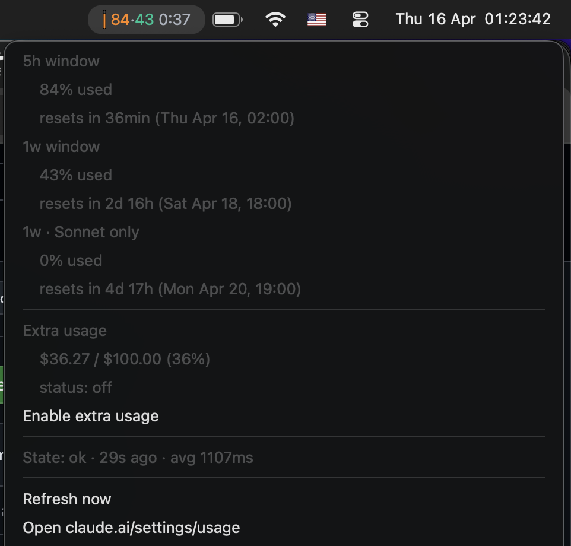

# claude-usage

macOS menu bar widget showing Claude's **5-hour** and **weekly** usage limits.
Scraped from [claude.ai/settings/usage](https://claude.ai/settings/usage), refreshed every 60 s.
Runs as a [Hammerspoon](https://www.hammerspoon.org/) Lua module.

<p align="center">
  
</p>

## Install

```bash
brew install --cask hammerspoon
git clone https://github.com/alexkirs/ccusage-mac.git ~/.hammerspoon/claude_usage
echo 'require("claude_usage")' >> ~/.hammerspoon/init.lua
```

Then:

1. Launch **Hammerspoon** (grant Accessibility on first run).
2. Click the menu bar icon → **Log in…** → log into claude.ai → close the window.
3. Values appear within ~60 s.

Hammerspoon auto-launches at login, so the widget does too.

## Use

| Action | Result |
|---|---|
| **Click** menu bar | Full menu: per-window %, reset times, Extra usage, actions |
| **Ctrl/Alt-click** | Compact two-line summary |
| **Refresh now** | Force immediate fetch |
| **Display format** | Compact / Compact + 5h reset / Labeled title style |
| **Enable/Disable extra usage** | Toggle overage spending from the menu |

## Updates

Built-in. Menu → **Updates**:

- `Check for updates now` — manual check
- `Check daily` (on by default) — auto-fetch origin/main every 24 h
- `Auto-apply updates` (on by default) — pull + reload silently when a new commit lands
- Toggle `Auto-apply updates` off if you'd rather review each release; an `⬆ Update available · Apply & reload` row appears inline when behind

No `git pull` needed.

## Uninstall

```bash
rm -rf ~/.hammerspoon/claude_usage
# edit ~/.hammerspoon/init.lua and remove: require("claude_usage")
```

## Dev

Work on the code with live reload:

```bash
git clone https://github.com/alexkirs/ccusage-mac.git
cd ccusage-mac
./install.sh   # symlinks into ~/.hammerspoon
```

`Live reload on file save` is on by default (~300 ms debounce on any `.lua` change). Toggle it, `Check daily`, and `Auto-apply updates` from the menu's **Updates** submenu. If you're editing code locally and don't want auto-pulls clobbering your work, flip `Auto-apply updates` off — `git pull --ff-only` also refuses unsafe merges on its own.

## License

MIT.
