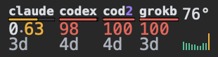

# ccusage-mac

Your AI subscription limits in the macOS menu bar. One strip, one block per account.

<p align="center">
  
</p>

Each block: **% used** (5-hour · weekly, or just weekly) and **time until reset**.
Green → yellow → orange → red as you burn through the limit.

Works with:

| Service | What it shows |
|---|---|
| **Claude** (claude.ai) | 5h and weekly limits, extra usage on/off |
| **Codex** (chatgpt.com) | weekly limit, Spark per-model limit |
| **Grok** (grok.com) | SuperGrok weekly pool |
| **Grok Bot** (cursor.com) | Grok Bot weekly allowance |

Any number of accounts per service. Refreshes every 60 s.

## Install

1. Install [Hammerspoon](https://www.hammerspoon.org/) (a free macOS automation app the widget runs inside):

   ```bash
   brew install --cask hammerspoon
   ```

2. Install the widget:

   ```bash
   git clone https://github.com/alexkirs/ccusage-mac.git ~/.hammerspoon/claude_usage
   echo 'require("claude_usage")' >> ~/.hammerspoon/init.lua
   ```

3. Open **Hammerspoon** from Applications. Allow Accessibility when it asks.

4. A `⚠ login` item appears in the menu bar. Click it → **Log in to claude.ai…** → sign in → close the window.

5. So it survives a reboot: click the Hammerspoon hammer icon in the menu bar → **Preferences…** → tick **Launch Hammerspoon at login**.

That's it. Numbers show up within a minute.

## Add more accounts

Click the strip → **Add account → …** → sign in → close the window.
Each account gets its own block in the strip and its own submenu: usage
detail, log in / log out, rename the label, hide the block (keeps the
session, frees menu bar space), remove it.

## Good to know

- Sessions expire when the site says so (Claude ~30 days, others longer). The block turns into `⚠ login`; click it and sign in again.
- Sign-in happens in a normal browser window inside Hammerspoon. Your Safari/Chrome logins are not touched.
- The widget updates itself from this repo daily (menu → **Updates** to turn that off).

## Uninstall

```bash
rm -rf ~/.hammerspoon/claude_usage
```

and delete the `require("claude_usage")` line from `~/.hammerspoon/init.lua`.

## License

MIT.
